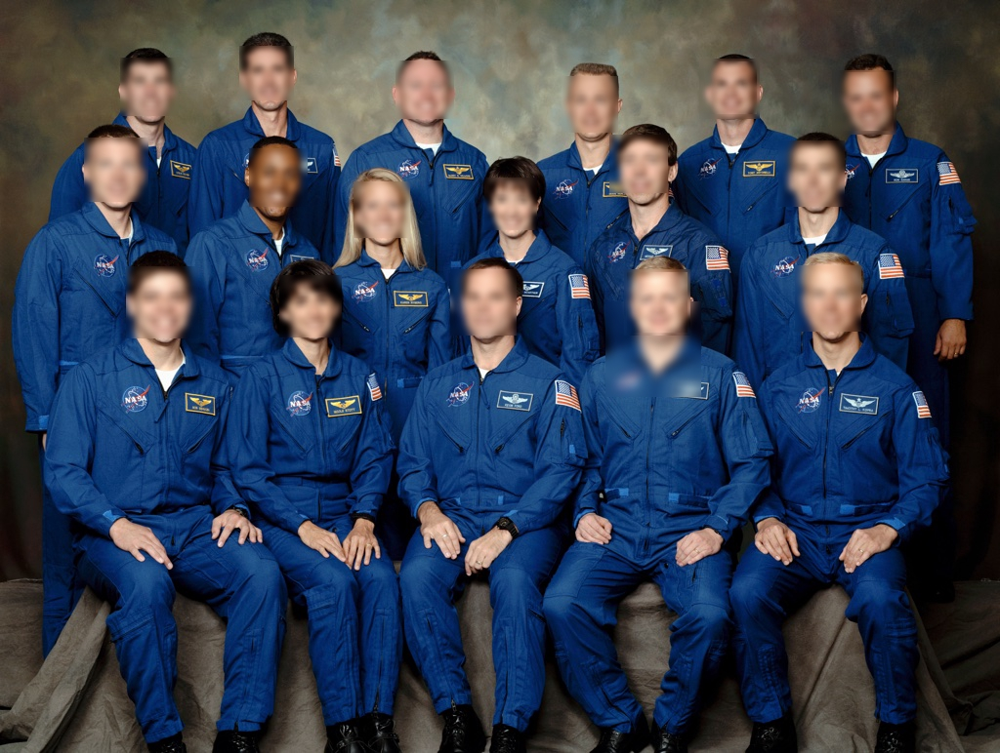

# Face Blur Application for OpenFaaS on ARM64/v8 (Raspberry Pi 4)
This repository contains the source code and setup instructions for a Face Blur application designed to work with OpenFaaS. It includes the implementation for face detection and blurring using the Pigo library. The application has been tested on Linux ARM64 architecture, such as Raspberry Pi 4, with OpenFaaS and faasd setups for edge devices.

> **Note:** The initial repository can be found at: [esimov/pigo-openfaas-faceblur](https://github.com/esimov/pigo-openfaas-faceblur). While the initial repository does not support ARM64/v8 architecture, this version has been updated to include such support. Developers can leverage the source code for exploring serverless architectures with OpenFaaS in real-world setups for edge devices.

---

## Project Structure

```
.
├── pigo-openfaas-faceblur
│   ├── data
│   │   └── facefinder
│   ├── Dockerfile
│   ├── function
│   │   ├── go.mod
│   │   ├── go.sum
│   │   └── handler.go
│   ├── go.mod
│   ├── go.sum
│   ├── go.work
│   ├── main.go
│   ├── output
│   │   ├── base64
│   │   │   └── output_image.base64
│   │   ├── images
│   │   │   └── output.jpeg
│   │   └── output.txt
│   ├── samples
│   │   ├── base64
│   │   │   └── image.base64
│   │   └── images
│   │       └── nasa.jpg
│   ├── stack.yml
│   └── template
│       ├── golang-http
│       │   ├── Dockerfile
│       │   ├── function
│       │   │   ├── go.mod
│       │   │   ├── go.sum
│       │   │   └── handler.go
│       │   ├── go.mod
│       │   ├── go.sum
│       │   ├── main.go
│       │   ├── modules-cleanup.sh
│       │   └── template.yml
│       └── golang-middleware
│           ├── Dockerfile
│           ├── function
│           │   ├── go.mod
│           │   └── handler.go
│           ├── go.mod
│           ├── go.work
│           ├── main.go
│           └── template.yml
└── README.md
```

---

## Prerequisites

1. **OpenFaaS CLI**

   - Install the OpenFaaS CLI from the official documentation: [OpenFaaS CLI](https://docs.openfaas.com/cli/install/).

2. **Docker Buildx**

   - Set up Docker Buildx for multi-platform builds. Refer to [Docker Buildx Documentation](https://docs.docker.com/buildx/working-with-buildx/).

3. **faasd Gateway** (Optional)

   - If you are using faasd, ensure that your gateway is accessible. Example gateway: `OpenFaas_Gateway_IP:8080`.

---

## Usage Instructions

### 1. Clone the Repository
```bash
$ git clone https://github.com/sarveshwaran1678/pigo-openfaas-arm64-faceblur
```

### 2. Update the `stack.yml` File
Before deploying, ensure you update the `stack.yml` file to replace placeholders with your details:

- Replace `USERNAME` with your Docker Hub username.
- Replace `IP` with the IP address of your OpenFaaS gateway.

---

## Installation Steps

### 1. Build and Push the Docker Image

```bash
docker buildx build --platform linux/arm64 \
  -t dockerhub_username/face_blur:latest \
  -f Dockerfile . --push
```

### 2. Deploy the Function to OpenFaaS Gateway

Login to the OpenFaaS Gateway:

```bash
faas-cli login --username admin --password <password> --gateway=OpenFaas_Gateway_IP:8080
```

Deploy the function:

```bash
faas-cli deploy --gateway=OpenFaas_Gateway_IP:8080
```

---

## Usage Instructions

### 1. Prepare Input Image

Convert an image to Base64 format:

```bash
base64 samples/nasa.jpg > image.base64
```

### 2. Invoke the Function

Invoke the deployed function using the OpenFaaS CLI:

```bash
faas-cli invoke pigo-faceblur --gateway=http://OpenFaas_Gateway_IP:8080 < image.base64 > output.txt
```

### 3. Decode Output Image

The `output.txt` file contains JSON data with the detected faces and the Base64-encoded image. Extract the `imagebase64` content into a new file, decode it back to an image, and compare both the input and output images to verify the face blur process:

```bash
# Extract the Base64-encoded image from the JSON output
jq -r '.imagebase64' output.txt > output/output.base64

# Decode the Base64 content to an image file
base64 -d output/output.base64 > output/output.jpeg
```

---

## Example Input and Output Images

### Input Image

The following image is used as input for the Face Blur application. It is stored in the `samples/images` directory.


### Output Image

The processed image with blurred faces is generated and stored in the `output/images` directory.



You can visually compare the input and output images to verify that faces in the input image have been successfully blurred in the output.

---

## Logs and Debugging

View the logs for the deployed function:

```bash
faas-cli logs pigo-faceblur --gateway=OpenFaas_Gateway_IP:8080
```

---

## Notes

- The `facefinder` data file is used for detecting faces and is located in the `data/` directory.
- The `samples/` directory contains example input files.
- The `output/` directory stores the generated results (Base64 and decoded images).


---

## Contribution

Feel free to contribute by creating a pull request or submitting issues. This project is designed for educational purposes and experimentation with serverless architectures and edge computing setups.

---

## License

This project is licensed under the MIT License. See the LICENSE file for details.

